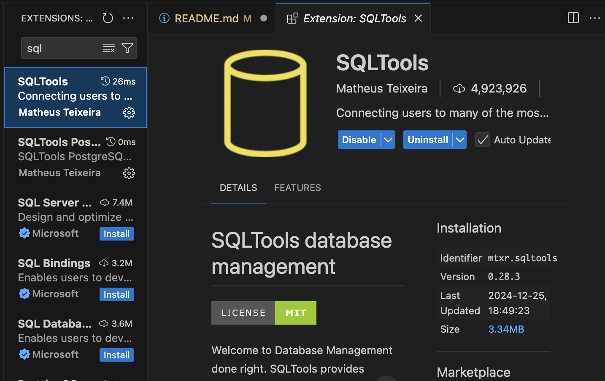
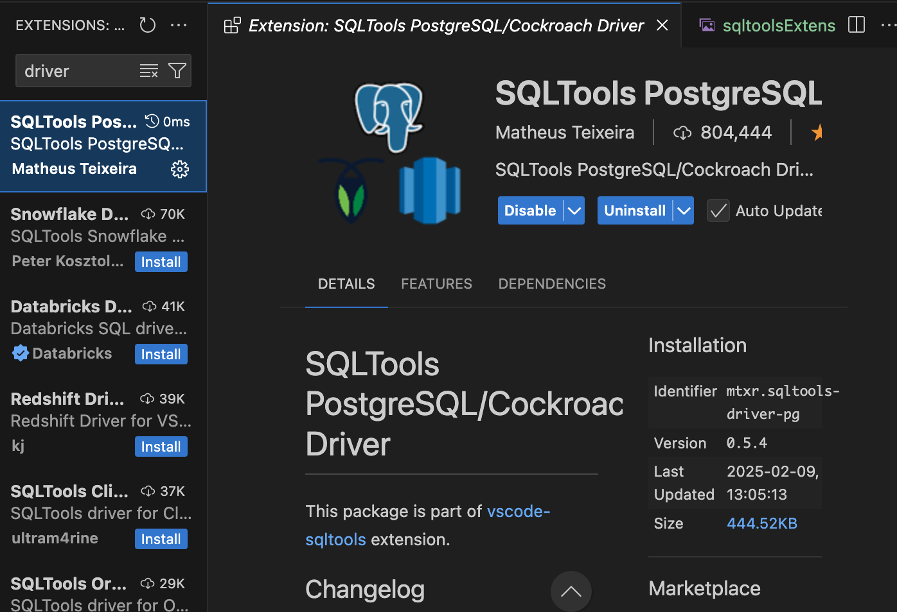
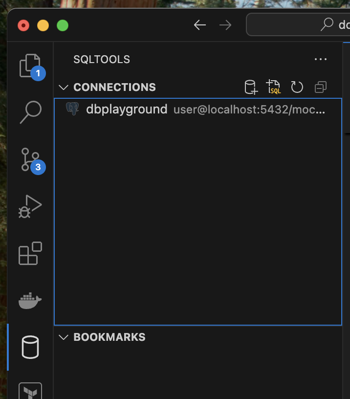
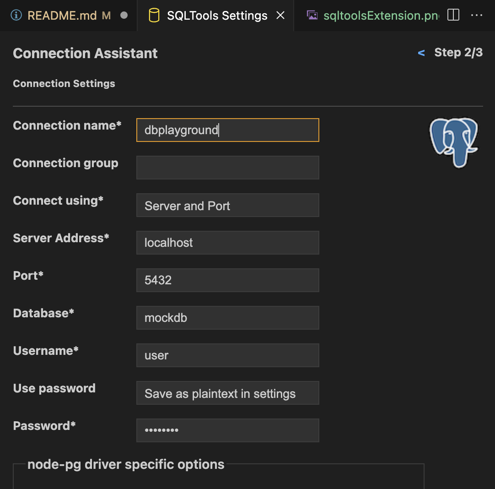

# docker-db-playground

## Requirements

- [Homebrew](https://brew.sh/)
- Flyway CLI (can be installed with `brew install flyway`)
- Github.com account (to get or fork the repo)
- [Docker Desktop](https://www.docker.com/get-started/) (to run the database and flyway)
- [Lazy Docker](https://github.com/jesseduffield/lazydocker?tab=readme-ov-file#homebrew) - not absolutely necessary, but a greate utility to have.
- IDE ([vscode](https://code.visualstudio.com/download) was used to initially develop this, but presumably any would do)
    - if using vscode: the plugin `SQLTools` to interact with the playground database. 
    - will also need postgres drivers, which can be found in vscode extensions as well. 

## Installing and Setup

1. Install the Flyway cli if you don't have it. 
2. Install Docker Desktop if you don't already have it.
3. (Optional) install lazy docker
4. Clone the repository
5. In your favorite terminal, navigate to the project repo.
6. Run `docker compose up` _Since this will be built with Docker, there is no need to run npm in the project directly._
7. Running sql tools in vscode:
    1. There should be a button on the left side of vscode that looks like a little cylinder.
    2. Click this and it should show something like this: 
    3. You can then click on a little 'add new connection button at the top right of the sql tools column. 
    4. Select postgresql for the database type.
    5. Settings: .
    6. Since this isn't connected to the internet and it's a playground, the password is: `password`.
    7. Save the connection.
    8. Should see the connection show up with a little green connection icon (this icon is how you can connect and disconnect).
    9. Connecting will also create and open a blank sql file/scratchpad to work from. 
8. You are now good to sql to your heart's content!

## Contributing

- If there is a bug or something that would be an easy quality of life thing:
    - Check the issues to see if someone else has had the same problem or want.
    - If you have something new, create an issue and fill out the form providing as much detail as possible.
    